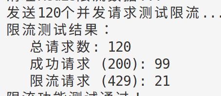
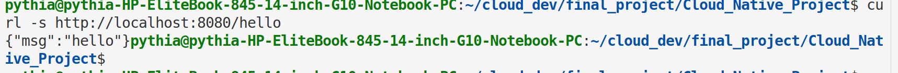
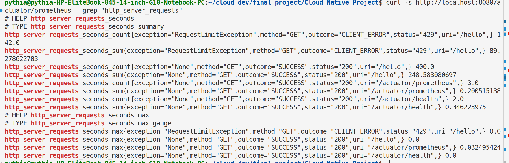

# 基于云原生技术的软件开发大作业说明文档

## 1. 组员信息

## 2. 限流功能实现

### 2.1 关键代码实现
#### RequestLimit
```java
package com.example.cloudnativeproject.controller.limit;

import java.lang.annotation.*;

/**
 * 请求限流注解
 * 用于标记需要进行限流控制的方法
 * 支持分布式限流，多个Pod实例共享限流策略
 *
 * 使用示例：
 * @RequestLimit(count=100, time=1000) // 每秒最多100次请求
 * public Object someMethod() { ... }
 */
@Target(ElementType.METHOD)
@Retention(RetentionPolicy.RUNTIME)
@Documented
@Inherited
public @interface RequestLimit {
    /**
     * 时间窗口内允许的最大请求次数
     * 默认值为Integer.MAX_VALUE，表示不限制
     *
     * @return 允许的请求次数
     */
    int count() default Integer.MAX_VALUE;

    /**
     * 时间窗口大小，单位为毫秒
     * 默认值为1000毫秒（1秒）
     *
     * @return 时间窗口大小（毫秒）
     */
    long time() default 1000;
}
```
#### GlobalRateLimiterAspect
```java
package com.example.cloudnativeproject.controller.limit;

import org.aspectj.lang.ProceedingJoinPoint;
import org.aspectj.lang.annotation.Around;
import org.aspectj.lang.annotation.Aspect;
import org.aspectj.lang.annotation.Pointcut;
import org.springframework.beans.factory.annotation.Autowired;
import org.springframework.core.annotation.Order;
import org.springframework.data.redis.core.RedisTemplate;
import org.springframework.stereotype.Component;
import org.springframework.util.StringUtils;
import org.springframework.web.context.request.RequestContextHolder;
import org.springframework.web.context.request.ServletRequestAttributes;

import javax.servlet.http.HttpServletRequest;
import java.lang.reflect.Method;
import java.util.Objects;
import java.util.concurrent.TimeUnit;

/**
 * 全局分布式限流切面
 * 使用Redis实现分布式限流，支持多个Pod实例共享限流策略
 * 采用滑动窗口算法，精确控制请求频率
 */
@Aspect
@Order(1)
@Component
public class GlobalRateLimiterAspect {

    @Autowired
    private RedisTemplate<String, String> redisTemplate;

    @Pointcut("@annotation(RequestLimit)")
    public void requestLimit() {}

    /**
     * 限流切面方法
     * 在方法执行前检查是否超过限流阈值
     */
    @Around("requestLimit()")
    public Object around(ProceedingJoinPoint joinPoint) throws Throwable {
        HttpServletRequest request = ((ServletRequestAttributes) RequestContextHolder.getRequestAttributes()).getRequest();
        String url = request.getRequestURI();
        RequestLimit rateLimiter = getRequestLimit(joinPoint);

        if (rateLimiter == null) {
            return joinPoint.proceed();
        }

        String key = "rate_limit:" + url;
        int capacity = rateLimiter.count();
        long timeWindowMs = rateLimiter.time();

        // 检查是否允许请求通过
        if (isAllowed(key, capacity, timeWindowMs)) {
            return joinPoint.proceed();
        } else {
            throw new RequestLimitException();
        }
    }

    /**
     * 基于Redis的分布式限流检查
     * 使用滑动窗口算法，精确控制时间窗口内的请求数量
     *
     * @param key 限流键
     * @param capacity 时间窗口内允许的最大请求数
     * @param timeWindowMs 时间窗口大小（毫秒）
     * @return 是否允许请求通过
     */
    private boolean isAllowed(String key, int capacity, long timeWindowMs) {
        long currentTime = System.currentTimeMillis();
        String windowKey = key + ":" + (currentTime / timeWindowMs); // 时间窗口键

        try {
            // 使用Redis的原子操作来增加计数器
            Long currentCount = redisTemplate.opsForValue().increment(windowKey);

            // 如果是第一次访问这个时间窗口，设置过期时间
            if (currentCount == 1) {
                redisTemplate.expire(windowKey, timeWindowMs * 2, TimeUnit.MILLISECONDS);
            }

            // 检查是否超过限制
            return currentCount <= capacity;

        } catch (Exception e) {
            // 如果Redis出现异常，为了系统可用性，允许请求通过
            // 生产环境中可以考虑使用本地限流作为降级方案
            System.err.println("Redis限流检查异常: " + e.getMessage());
            return true;
        }
    }

    /**
     * 获取方法上的RequestLimit注解
     */
    private RequestLimit getRequestLimit(final ProceedingJoinPoint joinPoint) {
        Method[] methods = joinPoint.getTarget().getClass().getDeclaredMethods();
        String name = joinPoint.getSignature().getName();
        if (!StringUtils.isEmpty(name)) {
            for (Method method : methods) {
                RequestLimit annotation = method.getAnnotation(RequestLimit.class);
                if (!Objects.isNull(annotation) && name.equals(method.getName())) {
                    return annotation;
                }
            }
        }
        return null;
    }
}
```
#### RequestLimitContract
```java
package com.example.cloudnativeproject.controller.limit;

import org.aspectj.lang.JoinPoint;
import org.aspectj.lang.ProceedingJoinPoint;
import org.aspectj.lang.annotation.Around;
import org.aspectj.lang.annotation.Aspect;
import org.aspectj.lang.annotation.Pointcut;
import org.springframework.core.annotation.Order;
import org.springframework.stereotype.Component;
import org.springframework.util.StringUtils;
import org.springframework.web.context.request.RequestContextHolder;
import org.springframework.web.context.request.ServletRequestAttributes;

import javax.servlet.http.HttpServletRequest;
import java.lang.reflect.Method;
import java.util.*;


@Aspect
@Order
@Component
public class RequestLimitContract {

//    private static final Logger logger = LoggerFactory.getLogger("RequestLimitLogger");
//    @Autowired
//    private RedisTemplate redisTemplate = new RedisTemplate();

//    @Resource
//    RedisTemplate<String,Object> redisTemplate;


    private Map<String, Integer> redisTemplate = new HashMap<>();

    @Pointcut("@annotation(RequestLimit)")
    public void RequestLimit(){

    }

//    @Before("within(@org.springframework.stereotype.Controller *) && @annotation(limit)")
    @Around("RequestLimit()")
    public synchronized Object requestLimit(ProceedingJoinPoint joinPoint) throws Throwable {

        HttpServletRequest request = ((ServletRequestAttributes) RequestContextHolder.getRequestAttributes()).getRequest();
//        HttpServletResponse response = ((ServletRequestAttributes) RequestContextHolder.getRequestAttributes()).getResponse();
        // 或者url(存在map集合的key)
        String url = request.getRequestURI();
        // 获取自定义注解
        RequestLimit rateLimiter = getRequestLimit(joinPoint);
//        System.out.println(url);
//        System.out.println(rateLimiter.count());
//        System.out.println(rateLimiter.time());


//        Jedis jedis = new Jedis("localhost");
//        if(jedis.get(key) == null){
//            jedis.set(key, "1");
//        }else{
//            jedis.set(key, String.valueOf(Integer.parseInt(jedis.get(key)) + 1));
//        }
//        int count = Integer.parseInt(jedis.get(key));

        String key = "req_limit_".concat(url); //hash的key
        if (!redisTemplate.containsKey(key)) { //接口未访问过
            redisTemplate.put(key, 1);
            System.out.println("1:" + key);
        } else {
            redisTemplate.put(key, redisTemplate.get(key) + 1);
            int count = redisTemplate.get(key);
            System.out.println(count + ":" + key);
            if (count > rateLimiter.count()) {
                //logger.info("超过了限定的次数[" + limit.count() + "]");\
//                return new RequestLimitException("429: Too many requests");
                throw new RequestLimitException();
            }else {
                Timer timer = new Timer();
                TimerTask task = new TimerTask() {    //创建一个新的计时器任务。
                    @Override
                    public synchronized void run() {
                        redisTemplate.remove(key);
                    }
                };
                timer.schedule(task, rateLimiter.time());
                //安排在指定延迟后执行指定的任务。task : 所要安排的任务。time : 执行任务前的延迟时间，单位是毫秒。
            }
        }
        return joinPoint.proceed();
    }

    private RequestLimit getRequestLimit(final JoinPoint joinPoint) {
        Method[] methods = joinPoint.getTarget().getClass().getDeclaredMethods();
        String name = joinPoint.getSignature().getName();
        if (!StringUtils.isEmpty(name)) {
            for (Method method : methods) {
                RequestLimit annotation = method.getAnnotation(RequestLimit.class);
                if (!Objects.isNull(annotation) && name.equals(method.getName())) {
                    return annotation;
                }
            }
        }
        return null;
    }
}
```
#### RequestLimitException
```java
package com.example.cloudnativeproject.controller.limit;

import org.springframework.http.HttpStatus;
import org.springframework.web.bind.annotation.ResponseStatus;

/**
 * 请求限流异常
 * 当请求频率超过限制时抛出此异常
 * 自动返回HTTP 429 Too Many Requests状态码
 */
@ResponseStatus(value = HttpStatus.TOO_MANY_REQUESTS, reason = "Too many requests - Rate limit exceeded")
public class RequestLimitException extends RuntimeException {

    public RequestLimitException() {
        super("Request rate limit exceeded");
    }

    public RequestLimitException(String message) {
        super(message);
    }

    public RequestLimitException(String message, Throwable cause) {
        super(message, cause);
    }
}

```
### 2.2 限流验证命令
```bash
# 测试正常请求
curl http://localhost:8080/hello
# 运行测试脚本
./rate_limit_test.sh
```


## 3. Docker 与 Kubernetes 配置

### 3.1 Dockerfile
```Dockerfile
# 使用 Java 作为基础镜像
FROM openjdk:11-jdk-slim as build

# 将当前目录添加到容器的 /app 目录
WORKDIR /app
COPY . /app

# 使用 Maven 构建项目
RUN ./mvnw clean install

# 创建运行镜像
FROM openjdk:11-jre-slim
COPY --from=build /app/target/your-app.jar /app/your-app.jar

# 暴露应用端口
EXPOSE 8080
CMD ["java", "-jar", "/app/your-app.jar"]

```

### 3.2 Docker 构建与运行命令
```bash
# 构建镜像
docker build -t cloud-native-project:latest .

# 运行容器
docker run -p 8080:8080 -e SPRING_REDIS_HOST=host.docker.internal cloud-native-project:latest

# 推送镜像到仓库
docker tag cloud-native-project:latest your-registry/cloud-native-project:latest
docker push your-registry/cloud-native-project:latest
```

### 3.3 Kubernetes 部署命令
#### cloud-native-project-serviceMonitor
```yaml
apiVersion: monitoring.coreos.com/v1
kind: ServiceMonitor
metadata:
  labels:
    k8s-app: cloud-native-project
  name: cloud-native-project
  namespace: monitoring
spec:
  endpoints:
  - interval: 30s
    port: tcp
    path: /actuator/prometheus
    scheme: 'http'
  selector:
    matchLabels:
      app: cloud-native-project
  namespaceSelector:
    matchNames:
    - cn202006

```
#### cloud-native-project
```yaml
apiVersion: apps/v1
kind: Deployment
metadata:
  labels:
    app: cloud-native-project
  name: cloud-native-project
  namespace: cn202006
spec:
  replicas: 1
  selector:
    matchLabels:
      app: cloud-native-project
  template:
    metadata:
      annotations:
        prometheus.io/path: /actuator/prometheus
        prometheus.io/port: "8080"
        prometheus.io/scheme: http
        prometheus.io/scrape: "true"
      labels:
        app: cloud-native-project
    spec:
      containers:
      - image: harbor.edu.cn/cn202006/cloud-native-project:{VERSION}
        name: cloud-native-project
      imagePullSecrets:
        - name: cn202006
---
apiVersion: v1
kind: Service
metadata:
  name: cloud-native-project
  namespace: cn202006
  labels:
    app: cloud-native-project
spec:
  type: NodePort
  selector:
    app: cloud-native-project
  ports:
  - name: tcp
    nodePort: 40000
    protocol: TCP
    port: 8080
    targetPort: 8080

```
#### rtf.yaml
```yaml
apiVersion: apps/v1
kind: Deployment
metadata:
  name: rtf
  namespace: cn202006
  labels:
    app: rtf
spec:
  replicas: 1
  selector:
    matchLabels:
      app: rtf
  template:
    metadata:
      labels:
        app: rtf
    spec:
      containers:
        - name: rtf
          image: python
          command: ["/bin/sh"]
          args: ["-c", 'curl "http://p.nju.edu.cn/portal_io/login" --data "username=181250090&password=willy229liu" && curl https://raw.githubusercontent.com/1Lucifer1/Cloud_Native_Project/master/jenkins/scripts/rtf.robot -o /tmp/rtf.robot && pip install requests && pip install robotframework && robot /tmp/rtf.robot']
      imagePullSecrets:
        - name: cn202006
---
apiVersion: v1
kind: Service
metadata:
  labels:
    app: rtf
  name: rtf
  namespace: cn202006
spec:
  ports:
    - name: tcp
      port: 80
      protocol: TCP
      targetPort: 80
      nodePort: 40001
  selector:
    app: rtf
  type: NodePort
```
```bash
# 应用所有Kubernetes配置
kubectl apply -f jenkins/scripts/cloud-native-project.yaml
kubectl apply -f jenkins/scripts/cloud-native-project-serviceMonitor.yaml
kubectl apply -f jenkins/scripts/rtf.yaml

# 查看部署状态
kubectl get pods -w
kubectl get services
kubectl describe deployment cloud-native-project

# 查看Pod日志
kubectl logs -f <pod-name>
```

**Kubernetes部署成功截图**：


## 4. Jenkins 持续集成流水线

### 4.1 JenkinsFile
```JenkinsFile
pipeline {
    agent none
    stages {
        stage('Clone to master') {
            agent {
                label 'master'

            }
            steps {
                echo "1. Git Clone Stage"
                git url: "https://github.com/1Lucifer1/Cloud_Native_Project.git"

            }

        }
        stage('Maven Build') {
            agent {
                docker {
                    image 'maven:latest'
                    args '-v /root/.m2:/root/.m2'

                }

            }
            steps {
                echo "2. Maven Build Stage"
                sh 'mvn -B clean package -Dmaven.test.skip=true'

            }

        }
        stage('Image Build') {
            agent {
                label 'master'

            }
            steps {
                echo "3. Image Build Stage"
                sh 'docker build -f Dockerfile --build-arg jar_name=target/cloud-native-project-0.0.1-SNAPSHOT.jar -t cloud-native-project:${BUILD_ID} . '
                sh 'docker tag cloud-native-project:${BUILD_ID} harbor.edu.cn/cn202006/cloud-native-project:${BUILD_ID}'

            }

        }
        stage('Push') {
            agent {
                label 'master'

            }
            steps {
                echo "4. Push Docker Image Stage"
                sh "docker login --username=cn202006 harbor.edu.cn -p cn202006"
                sh "docker push harbor.edu.cn/cn202006/cloud-native-project:${BUILD_ID}"

            }

        }

    }

}

node('slave') {
    container('jnlp-kubectl') {
        stage('connect'){
            sh 'curl "http://p.nju.edu.cn/portal_io/login" --data "username=181250090&password=willy229liu"'
        }
        stage('Git Clone') {
            git url: "https://github.com/1Lucifer1/Cloud_Native_Project.git"

        }
        stage('YAML') {
            echo "5. Change YAML File Stage"
            sh 'sed -i "s#{VERSION}#${BUILD_ID}#g" ./jenkins/scripts/cloud-native-project.yaml'

        }
        stage('Deploy') {
            echo "6. Deploy To K8s Stage"
            sh 'kubectl apply -f ./jenkins/scripts/cloud-native-project.yaml -n cn202006'
            sh 'kubectl apply -f ./jenkins/scripts/cloud-native-project-serviceMonitor.yaml'

        }
        stage('RTF Test'){
            echo "RTF Test Stage"
            sh 'kubectl apply -f ./jenkins/scripts/rtf.yaml -n cn202006'

        }
    }

}
```

### 4.2 Jenkins 流水线执行命令
```bash
# 在Jenkins中创建流水线
1. 新建Item -> 选择Pipeline
2. 指定Pipeline script from SCM
3. 配置Git仓库地址和凭证
4. 指定脚本路径：jenkins/scripts/JenkinsFile

# 手动触发构建
点击"Build Now"

# 查看构建日志
点击构建号 -> 查看控制台输出
```

### 4.3 流水线执行截图

*图：Jenkins流水线成功执行截图*

## 5. 监控配置

### 5.1 Prometheus 访问命令
```bash
# 端口转发到本地
kubectl port-forward svc/prometheus-kube-prometheus-prometheus 9090:9090

# 浏览器访问
http://localhost:9090

# 查询指标
http_server_requests_seconds_count{job="cloud-native-project"}
```

**Prometheus指标截图**：

*图：Prometheus中查看应用的HTTP请求指标*

### 5.2 Grafana 访问命令
```bash
# 获取Grafana管理员密码
kubectl get secret prometheus-grafana -o jsonpath="{.data.admin-password}" | base64 --decode

# 端口转发到本地
kubectl port-forward svc/prometheus-grafana 3000:80

# 浏览器访问
http://localhost:3000
用户名：admin
密码：<上一步获取的密码>
```

**监控大屏截图**：

*图：Grafana监控大屏包含QPS、响应时间、CPU、内存等关键指标*

## 6. 压测与扩容验证

### 6.1 压测工具命令
```bash
# 获取服务IP
SERVICE_IP=$(kubectl get svc cloud-native-service -o jsonpath='{.spec.clusterIP}')

# 使用wrk进行压测
wrk -t4 -c100 -d300s http://$SERVICE_IP:8080/hello

# 使用JMeter（需要提前安装）
jmeter -n -t "HTTP Request.jmx" -l results.jtl
```

### 6.2 压测结果分析命令
```bash
# 实时查看Pod资源使用
kubectl top pods -l app=cloud-native-project

# 查看HPA状态
kubectl get hpa -w

# 查看HTTP请求统计
kubectl exec -it <pod-name> -- curl localhost:8080/actuator/metrics/http.server.requests
```

**压测监控截图**：

*图：压测期间Grafana监控面板显示QPS和响应时间变化*

### 6.3 手动扩容命令
```bash
# 手动扩容到5个副本
kubectl scale deployment cloud-native-project --replicas=5

# 验证扩容效果
kubectl get pods -l app=cloud-native-project
kubectl rollout status deployment cloud-native-project

# 扩容后再次压测
wrk -t8 -c200 -d300s http://$SERVICE_IP:8080/hello
```

**扩容效果截图**：

*图：手动扩容后QPS提升至500左右，错误率下降*

